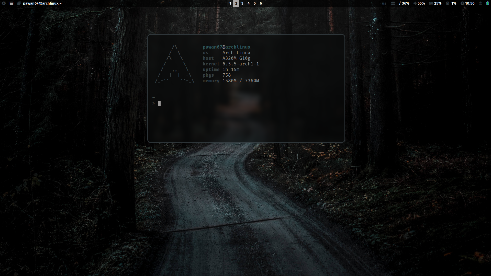

This is the configuration of my Arch linux based installation.


## Common Packages

- Terminal: alacritty
- Prompt: starship
- Icons: Font Awesome
- Menus: Rofi
- Colorscheme: pywal (dynamic)
- Browsers: thorium
- Filemanager: ranger, Thunar
- Cursor: Bibata Modern Classic
- Icons: breeze-dark
- Theme: Breeze-dark


## Qtile

- Compositor: picom
- Status Bar: polybar
- Screenshots: scrot

## Templating

Included is a pywal configuration that changes the color scheme based on a randomly selected wallpaper. Just type w in a terminal (or SuperKey + Shift + w). SuperKey + Ctrl + w opens rofi with a list of installed wallpapers for individual selection. See also the .bashrc for more alias definitions.

## Screenshots & Video



<b><a href="https://github.com/pawan67/dotfiles/-/tree/main/screenshots?ref_type=heads">You can find more screenshots here.</a></b>

## Getting started

To make it easy for you to get started with my dotfiles, here's a list of recommended next steps.

```
# Clone the repository from your home directory
git clone https://gitlab.com/pawan67/dotfiles.git

# Change into the new dotfiles folder
cd dotfiles

# Install all required packages
./1-install.sh

# Install hyprland window manager
./2-install-hyprland.sh
# OR/AND Install qtile window manager
./2-install-qtile.sh

# Install dotfiles
./3-install-dotfiles.sh

```


